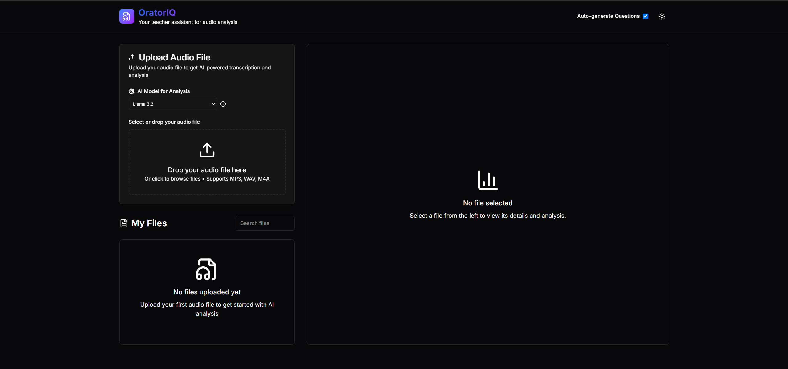

# OratorIQ

OratorIQ est un outil de transcription de cours transformant un enregistrement audio en texte structuré, résumés et questions générées automatiquement. Le projet repose sur un backend FastAPI et un frontend React pour un traitement fluide.



## Fonctionnalités clés

- **Téléversement simple** : glisser-déposer de fichiers audio.
- **Transcription et résumé** : extraction automatisée des points essentiels via l'IA.
- **Génération de Q&R** : création de questions à partir du contenu analysé.
- **Interface moderne** : application responsive avec mode sombre ou clair.

## Avantages

- **Gain de temps** : environ 3 minutes pour transcrire 1h10 d'audio avec un GPU Nvidia RTX 4060 mobile.
- **Déploiement Docker** : mise en service en quelques commandes tout en gardant vos données localement.

## Prérequis

- Distribution Linux basée sur Debian.
- [Docker Engine](https://docs.docker.com/engine/install/) et Docker Compose v2 ou supérieur.
- GPU Nvidia.

## Démarrage rapide

```bash
git clone https://github.com/HydroshieldMKII/OratorIQ
cd OratorIQ
chmod +x setupNvidiaContainerToolkit.sh  # configuration du GPU
./setupNvidiaContainerToolkit.sh
docker compose up --build
```

Ouvrez ensuite `http://localhost:3000` pour accéder à l'interface.

## Stack technique

- **Backend** : FastAPI, Python, SQLAlchemy
- **Frontend** : React, Vite, Tailwind CSS
- **Traitement audio** : OpenAI Whisper
- **Génération de contenu** : Ollama
- **Base de données** : SQLite
- **Containerisation** : Docker, Docker Compose

## Licence

Ce projet est une preuve de concept à des fins éducatives.
