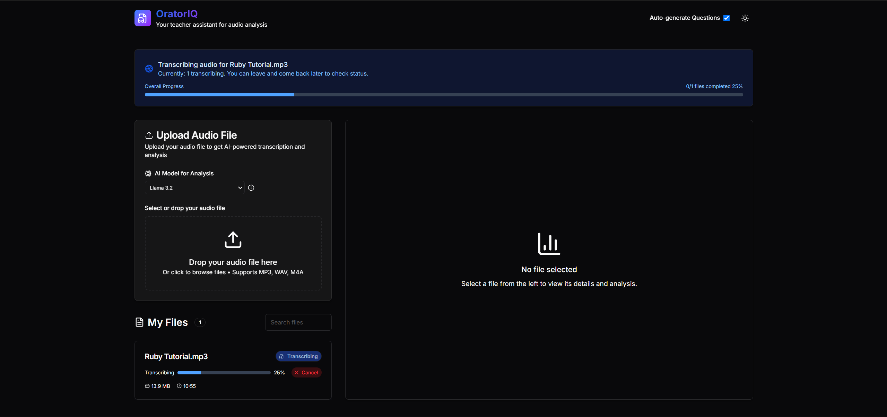

# OratorIQ

Un système sophistiqué de transcription de cours qui convertit les fichiers audio en contenu structuré avec des résumés automatisés et des questions générées automatiquement. Construit avec un backend FastAPI et un frontend React pour un traitement audio et une génération de contenu fluides.


## Fonctionnalités

- **Téléchargement et traitement audio** : Interface glisser-déposer pour faciliter le téléchargement de fichiers audio
- **Résumé intelligent** : Analyse de contenu alimentée par l'IA et extraction de points clés
- **Génération interactive de Q&R** : Questions automatisées basées sur le contenu du cours
- **Interface moderne** : Interface propre et responsive avec support de thème sombre/clair
- **Traitement en lot** : Prise en charge de plusieurs fichiers audio pour un traitement simultané

## Avantages

- **Gain de temps** : Convertit rapidement les cours audio en texte et en résumés
- **Application légère** : Conçu pour être rapide et efficace, même avec de gros fichiers audio
- **Hébergement facile** : Déployable en une seule commande via Docker pour une configuration simple, en gardant le contrôle de vos données

## Détails techniques

- **Stockage** : Le projet entier et le modèle de base utilise environs 15 Go d'espace disque
- **Mémoire RAM** : Le projet entier et le modèle de base utilise environs 6 Go de RAM

## Flux de travail de l'application

### 1. Téléchargez votre audio
Commencez par télécharger votre fichier audio de cours via l'interface.


### 2. Traitement en cours
Suivez la progression en temps réel pendant que votre audio est transcrit et analysé.




### 3. Traitement terminé
Recevez une notification lorsque votre cours a été entièrement traité et analysé.


### 4. Voir les résultats
Accédez à votre transcription, résumé et questions générées dans un format propre et organisé.


## Démarrage rapide

### Prérequis
- [Docker](https://docs.docker.com/engine/install/) installés sur votre système

### Configuration

1. **Cloner le dépôt** :
```bash
git clone https://github.com/HydroshieldMKII/OratorIQ
cd OratorIQ
```

2. **Déployer l'application** :
```bash
docker compose up --build
```

3. **Accéder à l'application** :
    - Ouvrez `http://localhost:3000` pour accéder à l'interface utilisateur

## Stack technologique

- **Backend** : FastAPI, Python, SQLAlchemy
- **Frontend** : React, Vite, Tailwind CSS
- **Traitement audio** : Openai-whisper pour les APIs de parole en texte
- **Intégration IA** : Ollama pour la résumé de contenu et la génération de questions
- **Base de données** : SQLite
- **Déploiement** : Docker, Docker Compose

## Licence

Ce projet est une preuve de concept à des fins éducatives.

